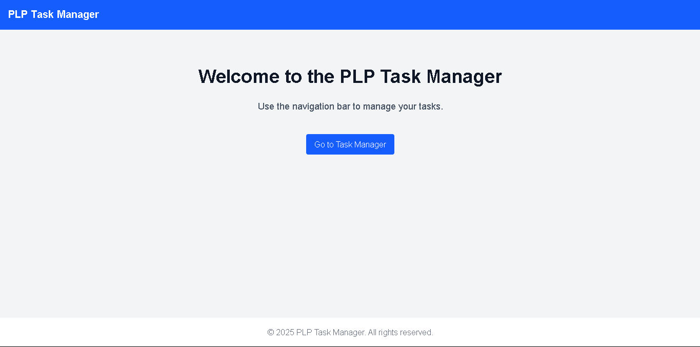
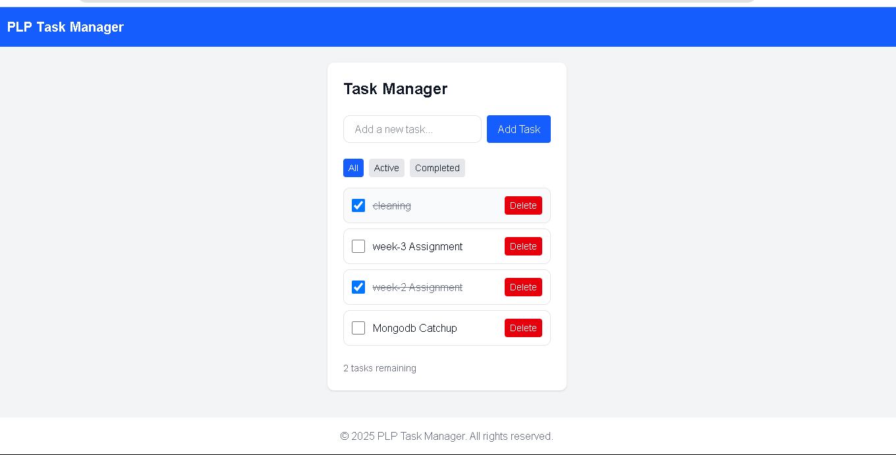

# PLP Task Manager

A simple and responsive task management application built with React and Tailwind CSS. It allows users to add, complete, delete, and filter tasks with data persisted in localStorage.

---


##  Features

- ✅ Add new tasks
- ✅ Mark tasks as completed or active
- ✅ Delete tasks
- ✅ Filter tasks by status: All, Active, Completed
- ✅ Dark mode support
- ✅ Data is persisted using localStorage

---

 ## Tech Stack

- **Frontend:** React (Vite)
- **Styling:** Tailwind CSS
- **Routing:** React Router DOM
- **State Management:** React `useState`, `useEffect`
- **Persistence:** `localStorage`


## Project Structure

```
my-app/
├── public/
├── src/
│ ├── components/
│ │ ├── Button.jsx
│ │ ├── Footer.jsx
│ │ ├── Navbar.jsx
│ │ └── TaskManager.jsx
│ ├── pages/
│ │ ├── Home.jsx
│ │ └── NotFound.jsx
│ ├── App.jsx
│ ├── App.css
│ └── main.jsx
├── package.json
└── README.md
```

## Getting Started

### Prerequisites

- node.js 

### Installation

1. **Clone the repository:**
bash
https://github.com/PLP-MERN-Stack-Development/week-3-react-js-assignment-KelvinMbugii.git

2. **Install dependencies:**
bash
npm install

3. **Run the development server:**
npm run dev

## Screenshots




## deployed application
bash
https://plp-mern-stack-development.github.io/week-3-react-js-assignment-KelvinMbugii/
